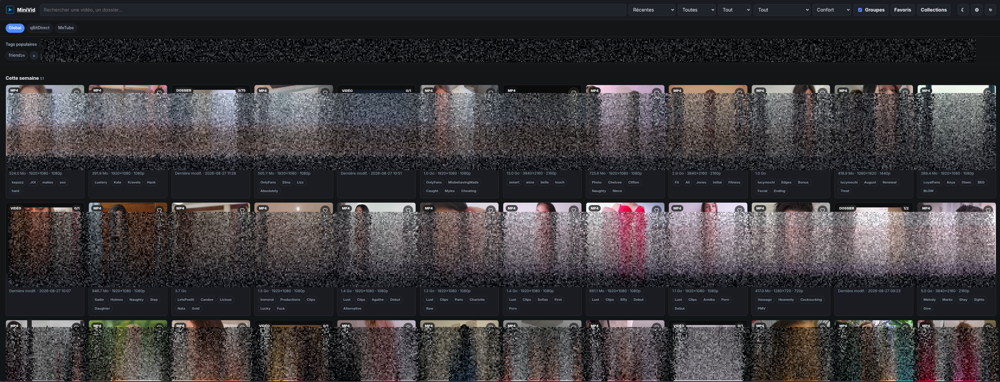
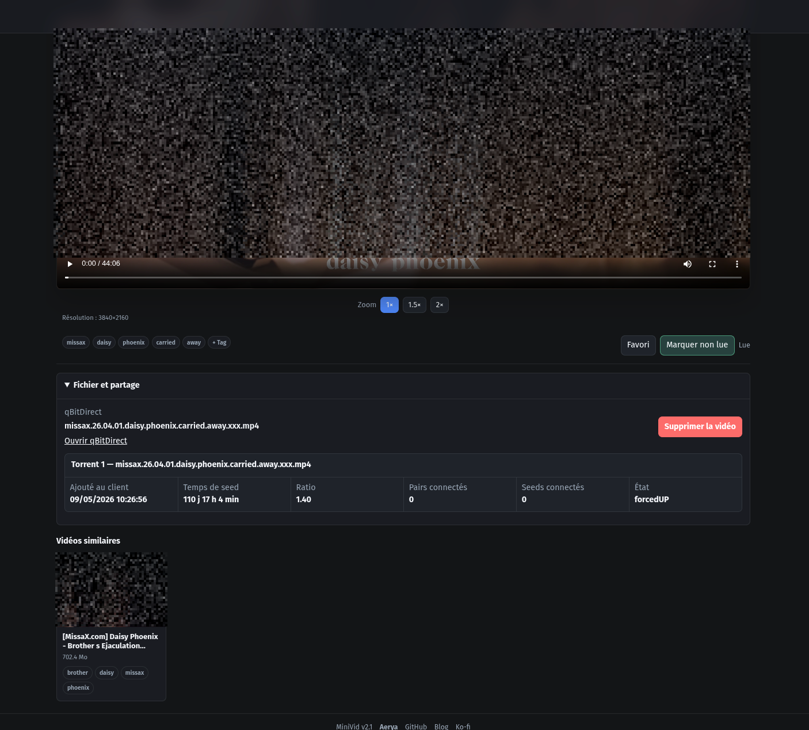
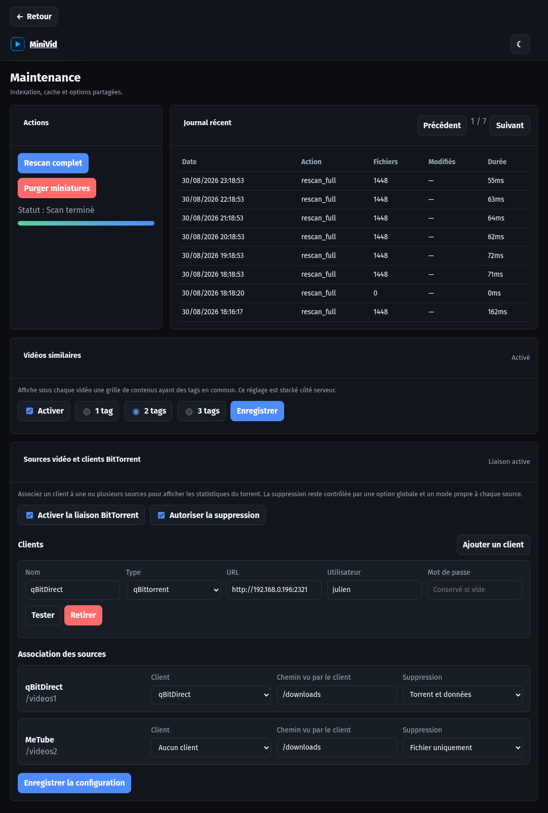

# MiniVid

MiniVid transforme un ou plusieurs dossiers vidéo en médiathèque web privée. L'application indexe les fichiers, génère les miniatures et permet de parcourir, rechercher et lire la collection depuis un navigateur.

<p align="center">
  🇬🇧 <a href="https://github.com/Aerya/MiniVid/blob/main/README.md">English</a> ·
  🇫🇷 Français
</p>

La lecture directe est toujours tentée en premier. Si le navigateur ne sait pas décoder un fichier, MiniVid peut basculer vers un flux HLS H.264/AAC sans perdre la position de lecture.

## Fonctionnalités

- Navigation par source et dossier, recherche, tags, favoris, collections et filtres lus/non lus.
- Miniatures automatiques, vidéos similaires, interface responsive clair/sombre et sélecteur de langue français/anglais persistant.
- Lecture directe avec fallback HLS logiciel, NVIDIA NVENC ou VA-API Intel/AMD.
- Rescans automatiques, authentification mono-utilisateur facultative et plusieurs clients qBittorrent ou ruTorrent.
- Suppression contrôlée du fichier vidéo ou de ses torrents associés, y compris les variantes cross-seed reconnues.

## Aperçu





## Installation

```bash
git clone https://github.com/Aerya/MiniVid.git
cd MiniVid
./minivid.sh
```

MiniVid crée sa configuration et les dossiers nécessaires, puis démarre avec `./videos`. L'interface est disponible sur `http://IP_DU_SERVEUR:8080`.

Pour utiliser un autre dossier, modifiez cette ligne dans `.env`, puis relancez `./minivid.sh` :

```dotenv
MINIVID_MEDIA_PATH=/mnt/films
```

Le Compose détecte automatiquement NVIDIA, Intel ou AMD, y compris depuis Dockge. Si Docker ne peut pas utiliser le GPU, MiniVid revient au CPU. Le mode peut être forcé dans `.env` :

```dotenv
MINIVID_GPU=cpu
# auto, cpu, nvidia, vaapi, intel ou amd
MINIVID_GPU_FALLBACK=1
```

Pour une configuration avancée, éditez les volumes vidéo supplémentaires dans `docker-compose.yml`, puis les valeurs correspondantes `MEDIA_DIRS` et `MEDIA_NAMES` dans `.env`. Les listes sont séparées par `|`.

```yaml
volumes:
  - /mnt/films:/videos1:ro
  - /mnt/archives:/videos2:ro
```

```dotenv
MEDIA_DIRS=/videos1|/videos2
MEDIA_NAMES=Films|Archives
```

Utilisez `:ro` pour une médiathèque en lecture seule. Une source configurée pour la suppression directe doit être montée en `:rw`.

Le lanceur génère la clé de session lorsque `openssl` est disponible. Pour la générer manuellement :

```bash
openssl rand -hex 32
```

Placez le résultat dans `SECRET_KEY`, puis démarrez MiniVid sans le lanceur si souhaité :

```bash
docker compose up -d
```

## Lecture et accélération GPU

MiniVid envoie d'abord le fichier original. En cas d'échec de lecture directe ou d'absence d'image décodée, le lecteur passe en HLS. La prise en charge dépend des codecs du navigateur et du système. Désactivez tout transcodage avec `MINI_TRANSCODE=0`.

Un helper éphémère prépare l'accès GPU avant le démarrage de MiniVid. Il teste l'encodeur dans Docker, régénère le CDI avec `nvidia-ctk` lorsqu'il est obsolète, puis expose NVIDIA ou `/dev/dri` au conteneur principal. Le conteneur MiniVid n'est pas privilégié et aucun override Compose ni `gpus: all` n'est nécessaire.

NVIDIA nécessite le pilote hôte et NVIDIA Container Toolkit. Intel/AMD nécessite `/dev/dri/renderD128`. Docker Engine 25 ou plus récent est requis pour CDI. Avec `MINIVID_GPU_FALLBACK=1` (valeur par défaut), un échec de détection sélectionne le CPU au lieu de bloquer le stack. Le mode CPU ARM64 est entièrement pris en charge ; VA-API est tenté avec les pilotes Mesa de l'image.

## Clients BitTorrent et suppression

La configuration se fait dans **Maintenance > Sources vidéo et clients BitTorrent** :

1. Ajoutez un client qBittorrent ou ruTorrent et testez sa connexion.
2. Associez chaque source vidéo au client concerné et indiquez le chemin vu par celui-ci.
3. Choisissez le mode de suppression, puis activez séparément la liaison BitTorrent et la suppression.

MiniVid affiche les torrents correspondant au fichier. La suppression « torrent et données » retire les torrents associés, y compris les variantes cross-seed reconnues, et vérifie le résultat avant de retirer la vidéo de l'index. La suppression exige l'authentification MiniVid. Les mots de passe des clients sont chiffrés avec `SECRET_KEY` ; changer cette clé oblige à les saisir de nouveau.

## Configuration utile

| Variable | Défaut | Rôle |
| --- | --- | --- |
| `MINIVID_MEDIA_PATH` | `./videos` | Premier dossier vidéo sur l'hôte |
| `MEDIA_DIRS` | `/videos1` | Chemins vidéo internes, séparés par `|` |
| `MEDIA_NAMES` | `Vidéos` | Noms affichés dans le même ordre |
| `MINI_ALLOWED_EXT` | formats courants | Extensions indexées |
| `MINI_BANNED_TAGS` | liste fournie | Mots ignorés lors des tags automatiques |
| `MINI_TRANSCODE` | `1` | Autorise le fallback HLS |
| `MINI_AUTOSCAN` | `1` | Active le rescan automatique |
| `MINI_SCAN_INTERVAL` | `3600` | Intervalle de scan en secondes |
| `MINI_USER` / `MINI_PASS` | vides | Active l'authentification si les deux sont définis |
| `SECRET_KEY` | aléatoire | Sessions et chiffrement des identifiants clients |

## Maintenance et mises à jour

La page Maintenance permet de rescanner la bibliothèque, purger les caches et consulter le journal récent. Le rescan périodique est assuré directement par MiniVid, sans conteneur planificateur séparé.

```bash
docker compose pull
docker compose up -d
```

Les données d'application restent dans `./data`. Les miniatures et segments temporaires restent dans `./cache`.

## Windows

Le script [Windows-MiniVid.cmd](https://github.com/Aerya/MiniVid/blob/main/Windows-MiniVid.cmd) propose le choix anglais/français à son lancement. Il vise Windows 10/11 x64 avec PowerShell 5.1, WSL2 et Docker Desktop. Il peut installer et démarrer Docker Desktop, générer une configuration pour des dossiers locaux ou des partages SMB/CIFS, tester les montages réseau, configurer l'authentification et valider le Compose avant le déploiement.

Le script est fourni **tel quel** (« as is »). Il n'a pas été testé sur une machine Windows locale par le mainteneur du projet : relisez-le et gardez des sauvegardes avant toute action destructive de son menu. Le profil initial utilise `C:\Videos`. L'assistant peut ajouter jusqu'à dix sources et choisir un autre port.

## Vie privée

Les vidéos, l'index, les miniatures et les préférences restent sur votre installation. Le chargement de `hls.js` depuis son CDN nécessite un accès externe.
